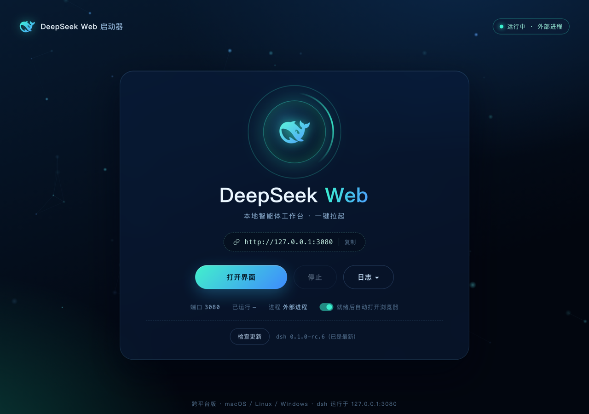

<div align="center">

# 🐋 DeepSeek Harness 启动台

**一键拉起 [DeepSeek dsh](https://www.npmjs.com/package/@deepseek-ai/dsh) 的本地启动台**

深海荧光界面 · 粒子呼吸灯 · macOS / Linux / Windows 三平台

   



</div>

---

## ✨ 为什么需要它

`npx @deepseek-ai/dsh web` 每次都要开终端、敲命令、等端口起来、再手动开浏览器。启动台把这一整套变成**一次双击**：

| 能力 | 说明 |
|---|---|
| 🚀 一键启动 | 后台拉起 `dsh web`（127.0.0.1:3080），就绪后自动打开浏览器界面 |
| 🔍 已运行检测 | 端口上已有实例（含你手动跑的）直接打开界面，不重复起进程 |
| 🛑 安全停止 | 只管自己拉起的进程；外部实例需**二次确认**才能强制停止，防误杀 |
| 📜 实时日志 | dsh 输出实时滚动展示，完整日志落盘可查 |
| 🔄 检测更新 | 比对 npx 缓存与 registry 最新版（自动读取 `.npmrc` 镜像源），一键更新 |
| 🫧 粒子呼吸灯 | 运行中粒子环绕呼吸 / 启动中琥珀脉冲 / 停止后归于沉寂，状态一眼可读 |
| 📦 macOS 专属 | 原生 App 一键安装到「应用程序」，支持开机自启 |
| 🪶 零依赖 | 跨平台版仅用 Node 标准库，无 node_modules，克隆即用 |

## 🚀 快速开始

### macOS（原生 App）

```bash
git clone https://github.com/TimSH021/deepseek-harness-launchpad.git
cd deepseek-harness-launchpad/macos
./build.sh            # 需要 Xcode Command Line Tools（clang + AppKit + WebKit）
open "DeepSeek Harness 启动台.app"
```

打开后可一键「安装到应用程序」和「开机自启」，之后从启动台 / Spotlight 搜「DeepSeek Harness」即可。

### Linux / Windows（跨平台版）

dsh 本身运行在 Node 上——**能跑 dsh 就能跑启动台**，无需任何额外依赖：

```bash
git clone https://github.com/TimSH021/deepseek-harness-launchpad.git
cd deepseek-harness-launchpad/cross
./start.sh                        # Linux / macOS
```

Windows 双击 `DSH-Launcher.vbs`（无黑窗）或 `DSH-Launcher.bat`。

Linux 桌面集成：把 `dsh-launcher.desktop` 中的 `%REPLACE_ME%` 替换为仓库绝对路径，复制到 `~/.local/share/applications/`。

### 🤖 让 AI 帮你装（推荐）

不想手敲命令？把下面整段复制给任意终端型 AI 助手（Claude Code / Codex CLI / Cursor / Gemini CLI 等），它会自动完成检测、克隆、构建、安装与验证：

```text
请帮我安装 DeepSeek Harness 启动台（开源仓库 https://github.com/TimSH021/deepseek-harness-launchpad），
它是 DeepSeek dsh（npx @deepseek-ai/dsh web）的一键启动器。请按以下步骤执行，每步给我结果反馈：

1. 检测当前操作系统（macOS / Linux / Windows）与已装工具（git、node --version）。
2. 克隆仓库到 ~/deepseek-harness-launchpad。
3. 按平台安装：
   - macOS：运行 xcode-select -p 确认 Command Line Tools，缺失就先安装；
     然后执行 ./macos/build.sh 构建原生 App（clang + AppKit + WebKit）；
     构建成功后把生成的「DeepSeek Harness 启动台.app」复制到 /Applications 并打开它。
   - Linux / Windows：确认 Node.js ≥ 18（dsh 依赖 Node）；
     运行 cross/start.sh（Linux/macOS）或告诉我双击 cross/DSH-Launcher.vbs（Windows）。
4. 验证安装：
   - macOS："DeepSeek Harness 启动台.app/Contents/MacOS/DSH Launcher" --probe
     应输出 alive=0 或 alive=1（ours=0 表示已有你手动启动的实例，属正常）；
     再跑一次 --bridge-test，应 5 项全部通过。
   - Linux / Windows：访问 http://127.0.0.1:4899 能看到启动台界面。
5. 遇到权限、网络或工具缺失问题时，先向我说明并获得确认再继续，不要静默跳过或伪造成功。
```

> 💡 提示词要求 AI「每步反馈 + 不静默跳过」，装完你会得到一份完整的执行记录，出问题随时能回溯。

## 🖥 界面一览

- **状态球**：青色呼吸+粒子环绕 = 运行中；琥珀脉冲 = 启动中；暗红静止 = 已停止
- **主按钮**：按状态自动切换「启动 DeepSeek / 打开界面 / 启动中…」
- **地址胶囊**：点击复制 `http://127.0.0.1:3080`
- **日志抽屉**：实时滚动 dsh 输出，错误行红色高亮
- **设置行**：开机自启（macOS）/ 一键安装（macOS）/ 检查更新（全平台）

## 🏗 架构

```
shared/index.html   统一界面（单文件；App 桥接 / HTTP 双模式自适应）
macos/main.m        原生 App（Objective-C + AppKit + WKWebView）
cross/server.js     跨平台版（Node 零依赖，macOS/Linux/Windows 进程分支）
```

三个平台共用同一套界面与指令集：`status / start / stop / open / logs / update-check / update-apply`。macOS 走 `WKScriptMessageHandlerWithReply` 桥接，其余平台走 `127.0.0.1` 本地 HTTP。

### 可靠性设计

- **就绪判定**：TCP 连接 + `GET /` 响应含 `__DSH_BOOT__`，端口被其他程序占用不会误判
- **停止策略**：自有实例杀整个进程组（spawn 时建组）/ 进程树，5 秒后 SIGKILL 兜底；Windows 用 `taskkill /T /F`
- **强制停止**：外部实例按端口反查 pid（lsof / netstat）再按进程树清理，UI 需二次确认
- **重启认领**：启动台重启后凭 `child.pid` 认领上次拉起的 dsh，继续可管

## 🧪 自测

```bash
# macOS（App 内置 CLI）
"DeepSeek Harness 启动台.app/Contents/MacOS/DSH Launcher" --probe          # 状态探测
"DeepSeek Harness 启动台.app/Contents/MacOS/DSH Launcher" --bridge-test    # 全部按钮对应的指令
DSH_LAUNCHER_DSH_PORT=4895 "DeepSeek Harness 启动台.app/Contents/MacOS/DSH Launcher" --selftest
```

`--bridge-test` 在隔离端口完整验证 启动→就绪→停止 生命周期与外部实例强制停止，不触碰你正在使用的实例。

## ⚙️ 配置

| 环境变量 | 默认 | 说明 |
|---|---|---|
| `DSH_PORT`（macOS 为 `DSH_LAUNCHER_DSH_PORT`） | `3080` | dsh web 端口 |
| `LAUNCHER_PORT` | `4899` | 跨平台版控制台端口 |

## ❓ FAQ

**Q：会误杀我在终端里跑的 dsh 吗？**
不会。「停止」只作用于启动台自己拉起的实例；对终端实例，按钮会变成「强制停止」并要求 3 秒内二次点击确认，误触不可能直接杀掉。

**Q：更新是怎么生效的？**
清理 npx 缓存目录，下次启动自动从你的 npm 源拉取最新版（首次约十几秒）。正在运行的实例不受影响，重启后生效。

**Q：3080 被别的程序占了会怎样？**
就绪探测会校验响应内容，非 dsh 页面不算「已运行」；启动新实例时 dsh 自身会报端口占用，日志抽屉里可以看到原因。

## 🤝 贡献

欢迎 issue / PR：界面打磨、Windows 打包（Inno Setup / pyinstaller 方案）、Linux AppImage、多语言。

如果它帮到了你，点个 ⭐ Star 让更多 dsh 用户看到！

## License

[MIT](LICENSE) © 2026 tangxy

---

## English

One-click local launchpad for the DeepSeek dsh web UI (`npx @deepseek-ai/dsh web`). Bioluminescent deep-sea UI with a particle breathing orb. Ships as a **native macOS app** (Objective-C + AppKit + WKWebView) and a **zero-dependency Node version** for Linux/Windows sharing the same single-file UI. Safe stop (own processes only; force-stop of external instances requires double confirmation), live logs, update checks via your npm registry, and CLI self-tests (`--probe` / `--bridge-test` / `--selftest`). MIT.
